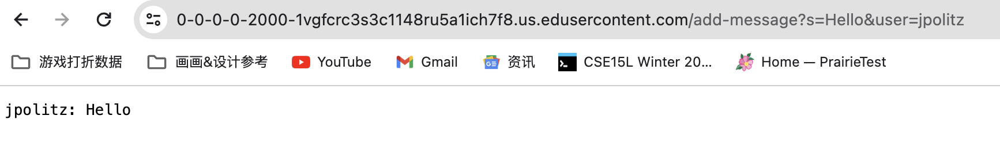
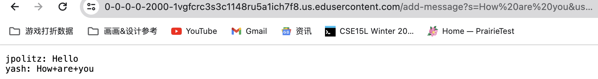

# Part 1
**ChatServer Code**
```
import java.io.IOException;
import java.net.URI;

class Handler implements URLHandler {
    String message = "";
    public String handleRequest(URI url) {
        if (url.getPath().equals("/")) {
            return String.format(message);
        }

        else if (url.getPath().contains("/add-message")) {
                String[] parameters = url.getQuery().split("&");
                String[] strInfo = parameters[0].split("=");
                String[] userName = parameters[1].split("=");
                message +=String.format("%s: %s \n", userName[1], strInfo[1]);
                return String.format("User %s added string %s", userName[1], strInfo[1]);
        }
        return "404 Not Found!";
        }
    }

class ChatServer {
    public static void main(String[] args) throws IOException {
        if(args.length == 0){
            System.out.println("Missing port number! Try any number between 1024 to 49151");
            return;
        }

        int port = Integer.parseInt(args[0]);
        Server.start(port, new Handler());
    }
}
```

**Screenshot Result**


- Method String handleRequest(URI URL) is called
- The argument to this method is the URI object named url, which is our port's url. The relevant
  field of this class is the String message, which is used to accumulate the inputs for different
  users. It's updated when a "/add-message" path is received. Other relevant fields include String[]
  parameters, String[] strInfo, String[] userName.
- In this specific request, the String message changed from nothing to "jpolitz: Hello". In this
  method, url.getPath() is used to get the path component of the URI, and url.getQuery() gets the
  query component of the URI. Then the three split() is used to split the query three times to get
  the two key components, userName and stringInfo that compose the message output.

  


- Method String handleRequest(URI URL) is called
- The argument to this method is the URI object named url. The relevant field of this class is
  the String message, which is used to accumulate the inputs for different users. Other relevant
  fields include String[] parameters, String[] strInfo, and String[] userName.
- In this specific request, a "/add-message" path is received. The string message changed from
  "jpolitz: Hello" to jpolitz: Hello \n yash: How+are+you" because a new userName and stringInfo
  is split from the path and appended into a String message.

# Part 2


